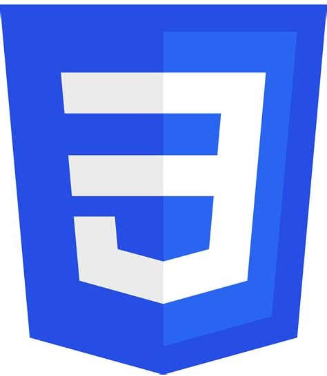
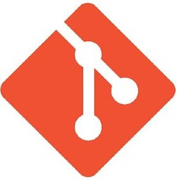
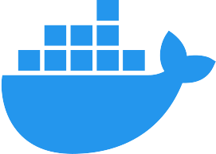

## Hello ! I am Marion, a web developer from France 🥐 

I changed career after being a product manager in the organic cosmetic field for more than 7 years, wanting to give more meaning to my work while enjoying doing a job that uses logic more.
 <h5> 
   <code><a href="https://www.linkedin.com/in/marionleblanc/" title="LinkedIn Profile"> LinkedIn: marionleblanc</a></code>
     
   <code><a href="mailto:marion.leblanc77@gmail.com/" title="Gmail addres"> marion.leblanc77@gmail.com</a></code>
 </h5>
Got my Titre Professionnel Développeur web et web mobile in September 🎓
Worked at Rakuten for 6 months as a Front-end Intern ⌨️
I speak French, English and could reactivate Spanish 💃🏻

## What's going on

🔭 I’m currently looking for a job  !
👩🏻‍💻 In the meantime, I am practicing and consolidating my skills by working on personnal project ideas : 

  <strong> 2DoIt </strong><a href="https://nx0dwjbucbs.preview.infomaniak.website/" title="2DoIt website">(link):</a> A personnal project to help my partner and I in our daily life. A partially shared to-do list where you can have your own private tasks and shared ones. See repos : <a href="https://github.com/MarionLeblanc77/2DoIt_front" title="2DoIt Front"><strong> FRONT </strong></a> & <a href="https://github.com/MarionLeblanc77/2DoIt_back" title="2DoIt Back"><strong> BACK </strong></a> 
    <ul>🎯 Objectives: get a MVP up and working 
     <ul><li>Basic interface 🚧</li>
     <li>CRUD for entities in back ✅</li>
     <li>Personnal tasks display and modification in front ✅</li> 
     <li>Connectivity with other user 🚧</li>
     <li>Basic personal settings</li></ul></ul> 

  <strong> Meal planner :</strong> A personnal project with my husband to help us plan for the meal of the week, generate automatic grocery list and serve as a recipe book. 
    <ul>🎯 Objectives: get a MVP up and working 
     <ul><li>Get a hold on what my husband has started coded</li>
     <li>Use the project to learn node.js and a back-end Javascript framework</li></ul></ul> 
    
  <a href="https://amidonapp.dev-me.fr/" title="Amidon"><strong> Amidon :</strong></a>  My end-of-school project. A private, simple and convenient website to giveaway your stuff to friends.  
    <ul>🎯 Objectives: optimizing
     <ul><li>deploy my local back-end change for the first time ✅</li>
     <li style="text-indent: 50px;">get RGPD right ✅</li>
     <li>Fixing functionning and layout bugs</li>
     <li>Adding placeholder to have a better understanding of the app when creating a new account</li>
     <li>Optimizing image size and loading</li></ul></ul>

<!-- 

 

 -->

## What I use
 
<table>
  <tr>
    <td align="center" width="96">
        
       PHP
    </td>
    <td align="center" width="96">
        
       Symfony
    </td>
        <td align="center" width="96">
        
       Laravel
    </td>
        <td align="center" width="96">
        
       mySQL
    </td>
  </tr>
  </table>
  
  <table>
  <tr>
    <td align="center" width="96">
        
       JavaScript
    </td>
    <td align="center" width="96">
        
       TypeScript
    </td>
        <td align="center" width="96">
        
       React.js
    </td>
        <td align="center" width="96">
        
       Redux
    </td>
        <td align="center" width="96">
        
       Axios
    </td>
        <td align="center" width="96">
        
       HTML
    </td>
        <td align="center" width="96">
        
       CSS
    </td>
        <td align="center" width="96">
        
       Sass
    </td>
  </tr>
</table>

<table>
  <tr>
    <td align="center" width="96">
        
       git
    </td>
    <td align="center" width="96">
        
       Github
    </td>
        <td align="center" width="96">
        
       Docker
    </td>
  </tr>
  </table>

   

